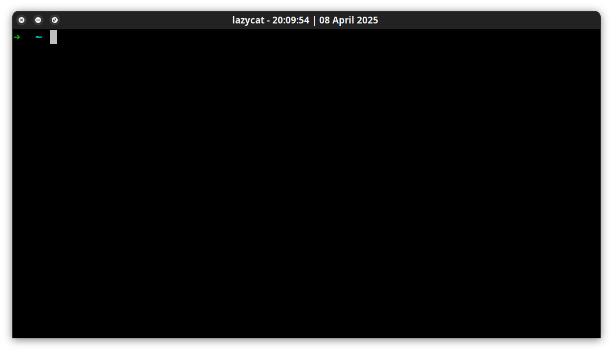

# LazyCat Terminal Emulator 

Standalone and dependenciless Terminal Emulator for Linux distro!

# screenshots





# Remember the following text for system-wide installation on UBUNTU:
```
make install
```


# Please remember the following steps for local execution:
1. Build the executable by running the command:
2. ```make lazyCat```
5. Execute the program by typing:
6. ```./lazyCat```
