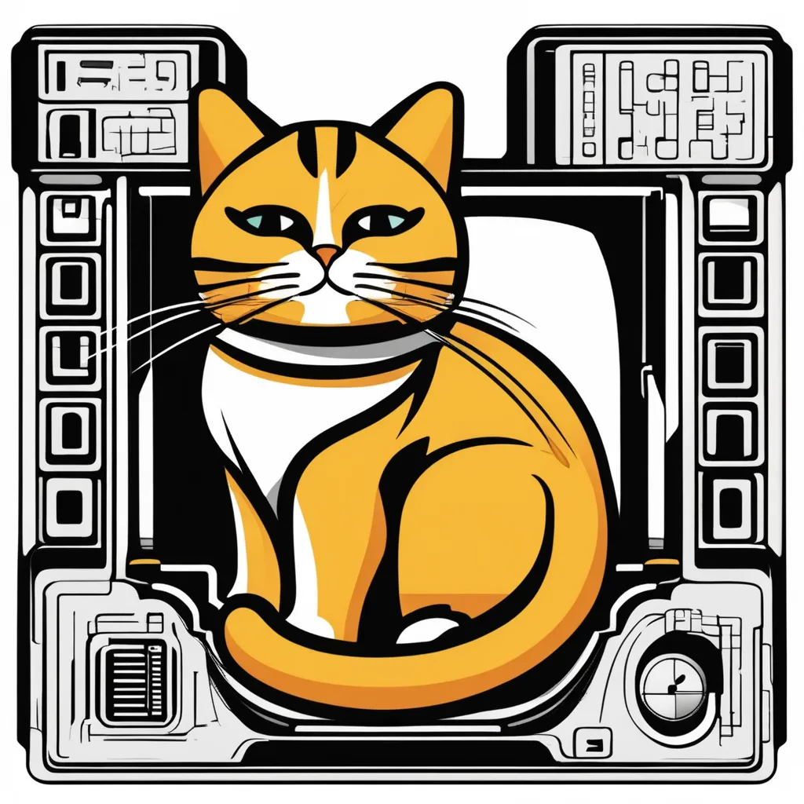

# LazyCat Terminal Emulator 

Standalone and dependenciless Terminal Emulator for UBUNTU distro!
## icon 


## screenshots
- Version 0.3 :Threading (2025):


### For system-wide installation on UBUNTU/Debian:
```
make install
```


### Local execution:
```
make run
```
