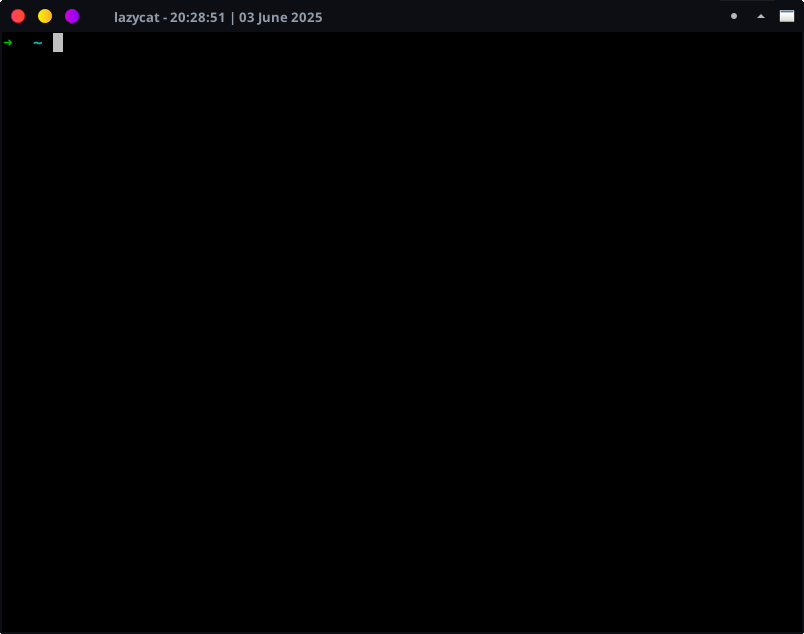

# LazyCat Terminal Emulator 

LazyCat is a stand-alone terminal for Linux that doesn’t need any extra dependencies!

## icon 


## screenshots
- Version 0.4 (2025):



### For system-wide installation:
```
make install
```


### Local execution:
```
make run
```
